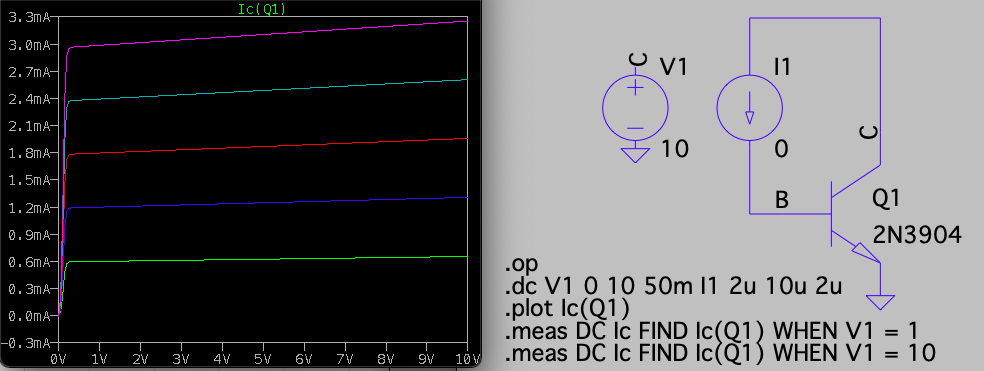

```{r setup, include = FALSE}
knitr::opts_chunk$set(echo = FALSE, message = FALSE, warning = FALSE, fig.height = 3.25, fig.width = 6.5, fig.align = 'center')
library(ggplot2)
library(latex2exp)
```

<!--
See Figure \ref{fig:p3mod} below.

{#fig:p3mod width=600 height=300}
-->

## Introduction

This lab introduces the BJT. Tasks in this lab are:

1. Simulate $I_C$ vs. $V_{CE}$ in LTspice using different base currents
2. Build a BJT circuit to plot observed $I_C$ vs. $V_{CE}$ for
different base currents
3. Show the current gain at $V_{CE} = 5V$ vs. $I_C$
4. Estimate the Early voltage for each base current observation
5. Estimate the empirical emission coefficient $n_F$
6. Estimate the reverse saturation current $I_S$
7. Compare the calculations for Parts 3-6 with the manufacturer's specifications
8. Discuss the pros and cons of assuming $V_{BE} = 0.7V$ for the forward
active BJT in circuit analysis.

## 1. LTspice Simulation

Here are the plots for $I_C$ vs. $V_{CE}$ in LTspice:

{width=75%}

The Early voltage is calculated by saving the curves at $V_{CE}$ at 1V and 10V:

| $I_B\ (\mu A)$| $I_C(V_{CE}=1V)\ (mA)$ | $I_C(V_{CE}=1V)\ (mA)$ | $V_{A}$ |
|---|:---:|:---:|:---:|
| 2 | 0.6012 | 0.6552 | 99.35 |
| 4 | 1.200 | 1.308 | 99.34 |
| 6 | 1.798 | 1.959 | 99.33 |
| 8 | 2.393 | 2.608 | 99.32 |
| 10 | 2.987 | 3.255  | 99.32 |

The calculated gain using $\Delta I_B$ for the $I_C$ simulated values
at $V_{CE} = 5V$:

| $I_B\ (\mu A)$| $\Delta I_B\ (\mu A)$ | $\Delta I_C(V_{CE}=5V)\ (mA)$ | $\beta$ |
|---|:---:|:---:|:---:|
| 4 | 2 | 0.6231 | 1.308 | 311.6 |
| 6 | 2 | 0.6212 | 1.959 | 310.6 |
| 8 | 2 | 0.6193 | 2.608 | 309.7 |
| 10 | 2 | 0.6175 | 3.255  | 308.7 |

## 2. Measured $I_C$ for $I_B$ and $V_{CE}$

```{r}
dat <- readr::read_csv("bjt-currents.csv")
dat |>
  dplyr::mutate(I_B = as.factor(I_B)) |>
  ggplot(aes(x = V_CE, y = I_C, color = I_B)) +
  geom_line() +
  geom_point() +
  scale_y_log10()
```

## 3. Current gain estimate

Using $\beta = \Delta I_C / \Delta I_B$ given the measured data at $V_{CE} = 5V$ (for $I_B \leq 50 \mu A$ to avoid large current effects):

| $\Delta I_B\ (\mu A)$ | $\Delta I_C\ (mA)$ | $\widehat{\beta}$ |
|---|---|---|
|$10 - 1$|$ 3.44-0.35$ | 343 |
|$50 - 10$|$ 19.1- 3.44$ | 391 |

## 4. Early voltage calculation

Using the range $V_{CE}$ from 1V to 10V, I have these two estimates for the
Early voltage:

| $I_B\ (\mu A)$ | $\widehat{V_A}$ |
|---|---|---|
|$10$|$1V - 9V \tfrac{0.33}{0.03} = -98.0$|
|$50$|$1V - 9V \tfrac{3.34}{0.29} = -102.7$|

## 5. Empirical emission coefficient

The empirical emission coefficient is between 1 and 2, there
values closer to 1 appear on ICs and to 2 for discrete diodes.

| $I_B\ (\mu A)$| $I_C\ (m A)$ | $V_{BE}\text{ when }V_{CE}=5V$ |
|---|---|---|
| 2 | 0.70 | 0.601 |
| 4 | 1.41 | 0.626 |

The calculation for $n_F$ proceeds in the following:

$$\frac{1.41}{0.70} = 
\frac{I_S\, \exp(0.626/(n_F\,V_T))}{I_S\, \exp(0.601/(n_F\,V_T))} $$

$$\ln(2.0143) = exp(0.025/(n_F\, V_T))$$
yielding $n_F = 1.37$.

## 6. Reverse saturation current $I_S$

Using $n_F = 1.37$ in the previous formulae gives $I_S = 32.9 pA$ which
is a very large value for $I_S$.

## 7. Listed values on 2N3904 LTspice model

.model 2N3904 NPN(IS=1E-14 VAF=100
+  Bf=300 IKF=0.4 XTB=1.5 BR=4 CJC=4E-12 CJE=8E-12 RB=20 RC=0.1 RE=0.1
+  TR=250E-9 TF=350E-12 ITF=1 VTF=2 XTF=3 Vceo=40 Icrating=200m mfg=NXP)

My estimate for $\beta$ is 367, close to the LTspice value of 300.
Even more impressive is the estimate for $V_A$ of 100.4, minorly
off from the LTspice value of 100.
My $I_S$ estimate is off by three orders of magnitude though.

## 8. Using a constant value for $V_{BE}$

The biggest pro for this simplification is that the schematic analyses
greatly simplify. Another pro is that the simplification is justified
in that every $36mV$ (using $n_F = 1.37$) the collector current
multiplies by 2.718, so keeping $I_C$ in a given range that doesn't vary 
broadly will constrain the base-emitter voltage to a limited range.
A con for this simplification is that a $83mV$ change in 
base-emitter voltage ($n_F = 1.37$) yields a 10x change in collector
current, so unless the current range is known, the base-emitter voltage could
be incorrect by over 100mV, and that magnitude could throw off
the analysis accuracy.

