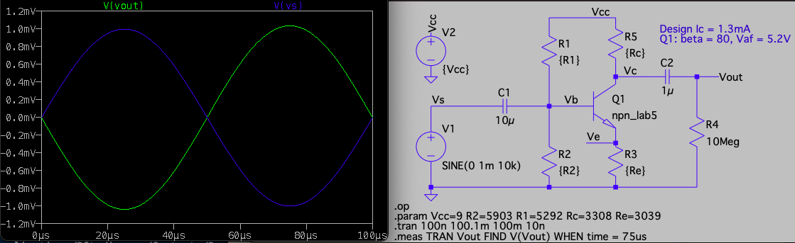
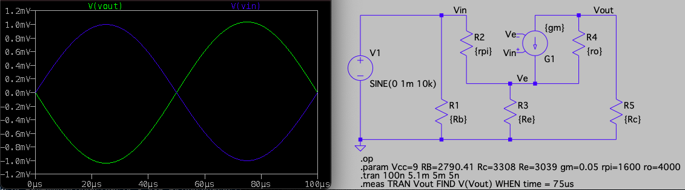
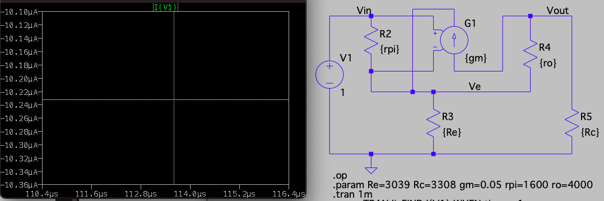
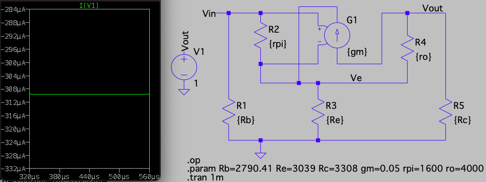

```{r setup, include = FALSE}
knitr::opts_chunk$set(echo = FALSE, message = FALSE, warning = FALSE, fig.height = 3.25, fig.width = 6.5, fig.align = 'center')
library(ggplot2)
library(latex2exp)
```

<!--
See Figure \ref{fig:p3mod} below.

{#fig:p3mod width=600 height=300}
-->

## Introduction

This lab summarizes my own investigation of the voltage gain
$v_{out}/v_{in}$ for the Common Emitter amplifier with a finite
Early voltage. This research sprung from my attempt to solve question
4 of Homework 6 when accounting for base width modulation.

I knew that $r_o$ inclusion was not required but I wanted to solve
for the gain anyway. Even despite the warning from
Sedra and Smith who advise to ignore $r_o$ in the small-signal model:
"[...] note that we have not included $r_o$, 
because it would complicate the analysis
significantly, which is not worth the trouble, given that $r_o$ has little
effect on the performance of discrete-circuit amplifiers." (p. 467, 8th ed.)

A search for the gain found only this equation for the voltage gain,

$$ \frac{v_{out}}{v_{in}} \approx - \frac {g_m \big( R_C \,\Vert\, r_o(1+g_m R_E)\big)}
{1+g_m R_E},$$

(see [MIT Course link, slide 19](http://web.mit.edu/6.012/FALL00/www/handouts/lec19.pdf)
and another YouTube video with the same result)
but as I'll show this equation isn't exactly correct. 
The derivation on YouTube neglects the base current's
contribution to the voltage of the emitter resistor twice,
and this simplification can lead to significant errors
when either $\frac {R_E}{r_\pi}$ or $\frac{R_E}{\beta r_o}$
is not negligibly small. I confirmed that adding the missing 
emitter voltage contribution yields the same equation that I
derive in this report.

This report has three sections. 
In the first section, I derive $A_v$
for a CE amplifier with emitter degeneration and base width modulation
effects under a typical four resistor biasing scheme.
In the second section,
I present a summary 
for these CE amplifiers as they grow in
complexity:

1. CE amplifier without $R_E$ or base width modulation,
2. CE amplifier with base width modulation ($V_A < \infty$),
3. CE amplifier with emitter degeneration ($V_A = \infty$),
4. CE amplifier with emitter degeneration and base width modulation.

The third section presents comprehensive LTspice simulations
that confirm the derivations. 

# Voltage gain for the CE amplifier with emitter degeneration and $V_A < \infty$

Here is a schematic of the amplifier under consideration (DC then AC):

$\hspace{1.5in}$
{width=60%}

$\hspace{1.5in}$
{width=60%}


There are two important equations to derive the voltage gain.
The first is KCL at the emitter node using the collector current through
$R_C$:

$$v_{in} = v_\pi + \left( 
\frac{v_\pi}{r_\pi} - \frac{v_o}{R_C}
\right) R_E$$

After a Thevenin transform of the VCCS to a VCVS
(with voltage $-g_m r_o v_\pi$ and resistance $r_o$),
KVL yields:
$$v_o + g_m r_o v_\pi = -\frac{v_o}{R_C} r_o + \left( 
\frac{v_\pi}{r_\pi} - \frac{v_o}{R_C}
\right) R_E,$$

noting that on RHS the first term is the $r_o$ voltage using collector current
and the second term is the same $R_E$ voltage used in the first equation.
Here is a schematic of the KVL loop using the Thevenin source:

$\hspace{1.75in}$
{width=50%}

The first equation yields this substitution for $v_{\pi}$:

$$v_\pi = \left(v_i + \tfrac{R_E}{R_C} v_o\right) \tfrac{r_\pi}{r_\pi + R_E}$$
After substituting $v_\pi$ and some reduction, the voltage gain becomes

$$\frac{v_o}{v_i} = \frac{-R_C (\beta r_o - R_E)}{
r_\pi(r_o+R_C+R_E) +R_C R_E + (\beta+1)r_o R_E
}$$

# Summary of CE properties

| $R_E$ | $r_o$ | $A_v$ | 
|:-|:-|:------:|
| $0$ | $\infty$ |$-\frac{\beta R_c}{r_\pi}$|
||||
| $R_E$ | $\infty$ |$-\frac{\beta R_c}{r_\pi + (\beta+1) R_E}$|
||||
| $0$ | $r_o$ |$-\frac{\beta R_c}{r_\pi \big(1 + \tfrac{R_c}{r_o}\big)}$|
||||
| $R_E$ | $r_o$ |$-\frac{\big(\beta-\tfrac{R_E}{r_o}\big) R_c}{r_\pi \big(1 + \tfrac{R_c}{r_o}\big) + R_E \tfrac{r_\pi+R_C}{r_o}+(\beta+1) R_E}$|

| resistance | value as function of $R_E$ and $r_o$ |
|:--------:|:---------------------------------------|
|$R_{in}$| $R_1\| R_2 \| \Big\{\frac{r_\pi + (\beta+1)R_E + \tfrac 1 {r_o} (r_\pi R_C + r_\pi R_E + R_C R_E)}{1 + \tfrac 1 {r_o} (R_C+R_E)}\Big\}$|
|||
|$R_{out}$| $R_C \| \Big\{ r_o \frac{r_\pi+R_B+(\beta+1)R_E}{r_\pi+R_B+R_E} + (r_\pi + R_B)\|R_E \Big\}$|

# LTspice simulations

First, I simulate the DC and AC models for the following realistic test case:

* $I_C = 1.3mA$,  $\beta = 80$
* $g_m = 0.05$, $r_\pi = 1600$, $I_B = 16\mu A$, $I_E = 1.316mA$
* $V_{CC} = 9V$, $V_E = 4V$ and $V_B = 4.7V$ 
* $V_CE = 0.7V$, $V_BC = 0V$ (limit input to $5mV$ to remain in soft saturation)
* $R_E = 4V/I_E = 3039 \Omega$, $R_C = 4.3V/I_C = 3308\Omega$
* $R_1 = 4.3V/(50\, I_B) = 5292\Omega$, $R_2 = 4.7/(49, I_B) = 5903\Omega$
* $I_S = 1.3mA\; \exp(-0.7V/V_T) = 2.639 fA$
* $V_A = 5.2V$, $r_o = 4000\Omega$

Note that the transistor must be kept close to saturation in order
to achieve the desired $\beta$, otherwise the small signal parameters
change. 

The voltage gain should be 

$$\frac{v_{out}}{v_{in}} = -\frac{\big(80 - \tfrac{3039}{4000}\big) 3308}{1600 \big(1 + \tfrac{3308}{4000}\big) + 3039 \tfrac{1600+3308}{4000}+81\cdot 3039} \\ \phantom{-M} =
\frac{-262126.75}{2923.20 + 3728.85 + 246159.00} = -1.03685,$$

noting that the voltage gain formula given online yields

$$\frac{v_{out}}{v_{in}} = \frac{-g_m r_o R_C}{R_C + r_o + R_E(1+g_m r_o)} =
\frac{-0.05\cdot 4000\cdot 3308}{3308 + 4000 + 3039(1+0.05\cdot 4000)} =
\frac{-661600}{618147} = -1.07030,$$

which is $3.23\%$ higher than my calculated value. Note that larger collector
currents, lower gain, or lower $r_o$ amplify this error.

## DC Simulation



The result of the saved measurement at the $V_{out}$ peak is:

| time | $V_{out}$ | 
|:----:|:--------:|
| $75\mu s$ | $1.03611 mV$ |

with the difference from the calculated value due to the small loss
in the output RC circuit.


## AC Simulation



The result of the saved measurement at the $V_{out}$ peak is:

| time | $V_{out}$ | 
|:----:|:--------:|
| $75\mu s$ | $1.03684 mV$ |

which is essentially no difference from the calculated value.

## Input resistance

We can run an input resistance test in LTspice using a $1V$ input.


The calculated $R_{in}$ with my derived formula is:

$$R_{in} = 
2790.41 \| R_{in,b} $$
$$R_{in,b} = \frac{1600 + (81)3039 + \tfrac 1 {4000} (1600 \cdot 3308 + 1600 \cdot 3039 + 3308 \cdot 3039)}{1 + \tfrac 1 {4000} (6347)}\\
= \frac{1600 + 246159 + 5052}{2.58675}= \frac{252811}{2.58675} = 97.733 k\Omega$$

| time | $I(V_1)$ | $1V / I(V_1)$ |
|:----:|:--------:|:---------:|
| $1 ms$ | $10.23195 \mu A$ | $97733 \Omega$ |

## Output resistance

Similarly we can run an output resistance test in LTspice using a $1V$ input.



The calculated $R_{out}$ with my derived formula is:

$$R_{out} = 
3308 \| \Big\{ 4000 \frac{1600+2790.41+246159}{7429.41} + (4390.41\|3039) \Big\} \\
= 3308 \| (134896.0 + 1795.9) = 3229.837 \Omega$$

| time | $I(V_1)$ | $1V / I(V_1)$ |
|:----:|:--------:|:---------:|
| $1 ms$ | $309.613 \mu A$ | $3229.839 \Omega$ |

# Discussion

This lab is a great demonstration of how I can use LTspice
to address circuit questions in the future.
I successfully confirmed my derivations for all three amplifier
performance characteristics (voltage gain, input resistance, and output resistance) for the complex case of a common emitter amplifier
with a emitter resistance under base width modulation. 

I have confirmed
that if you select $R_E = \beta r_o$, albeit an unlikely condition,
the CE voltage gain is zero. This guides the designer in choosing
$r_o$ and $\beta$ relative to $R_E$ in order to maximize voltage gain.


