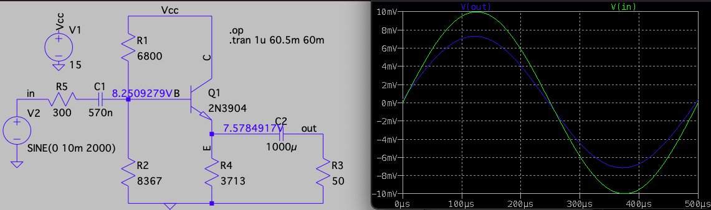
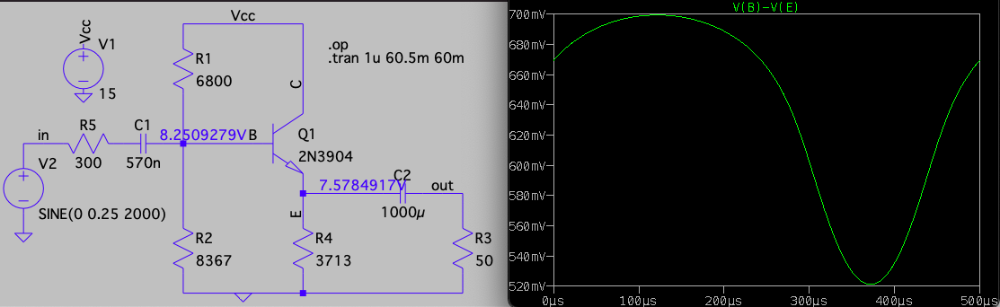
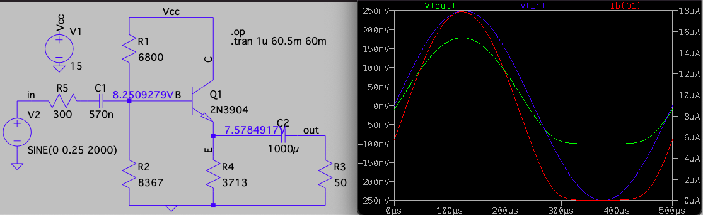

```{r setup, include = FALSE}
knitr::opts_chunk$set(echo = FALSE, message = FALSE, warning = FALSE, fig.height = 3.25, fig.width = 6.5, fig.align = 'center')
library(ggplot2)
library(latex2exp)
```

<!--
See Figure \ref{fig:p3mod} below.

{#fig:p3mod width=600 height=300}
-->

# Introduction

This lab sets the operating point the BJT in a common collector amplifier
and then uses LTspice simulations to confirm
the DC operating point. I did not have enough time to prototype the
circuit and measure the DC and AC characteristics.

# Design Procedure

Here are the calculated values for this biasing topology:



The formulae for the voltage ratios are:

$$\frac {v_{out}} {v_{in}} =
\frac {(\beta + 1)R_E'}{r_\pi + (\beta + 1)R_E'} \\
\frac {v_{in}} {v_{s}} = \frac {R_{in}} {R_S + R_{in}}$$

where 

$$R_E' = R_E \parallel R_L \parallel r_o \\ 
R_{in} = R_B \parallel \left( r_\pi + (\beta+1) R_E' \right)$$

The calculations are
$v_{out}/v_{s} = (v_{out}/v_{in})(v_{in}/v_{s}) = (0.793)(0.926) = 0.73$
which is confirmed by the operating point plot of $v_{out}$ vs. $v_s$.

# Output waveform being sinusoidal

The output waveform has gain reduction when the base voltage is reduced by
a large amount. The amount depends on the load resistor, as $R_L = 1k\Omega$
was able to tolerate a larger negative voltage. The reason for this is
the $v_{out}/v_{in}$ equation and its $r_\pi = \tfrac {\beta\, V_T}{I_C}$ 
in the denominator. Look at how $V_{BE}$ changes greatly when the base voltage decreases:



This change for $V_{BE}$ explains why the current changes so much (and goes to zero if $V_B$ is greatly reduced):



As $r_\pi$ is inversely proportional to $I_C$, the reduced $V_B$ kills
the collector current which caused the voltage ratio $v_{out}/v_{in}$ to
be greatly reduced.


