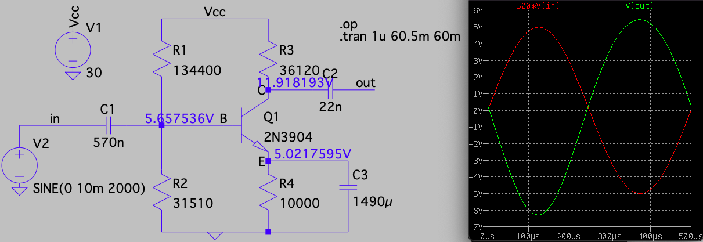
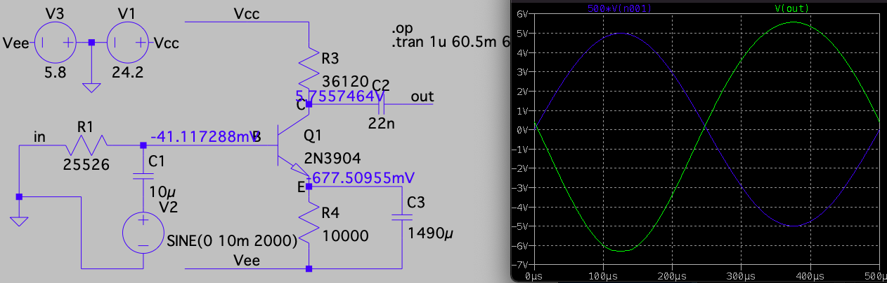

```{r setup, include = FALSE}
knitr::opts_chunk$set(echo = FALSE, message = FALSE, warning = FALSE, fig.height = 3.25, fig.width = 6.5, fig.align = 'center')
library(ggplot2)
library(latex2exp)
```

<!--
See Figure \ref{fig:p3mod} below.

{#fig:p3mod width=600 height=300}
-->

# Introduction

This lab sets the operating point the BJT in a common emitter amplifier using
the two typical biasing schemes:

1. four-resistor, single-supply topology
2. three-resistor, dual-supply topology

# Four-resistor, single-supply biasing

## Design Procedure

First, I set $I_C = 5$ mA as this amplifier is for voltage gain,
using a second stage for current gain. (See Lab 7.) A larger collector
current will increase the transconductance and boost the voltage gain,
so I keep the current as large as I can given the power specs
(to be calculated later). --Actually, a reason to keep current low is to increase $1/g_m$ to keep the emitter capacitor small because audio
frequencies of 20Hz have large impedance at that $f$.

Next, I decide the input voltage swing should accommodate $\pm 10$ mV.
I desire a large voltage gain, with the understanding that I will
put a capacitor across the emitter resistance in order to achieve
maximum gain. A gain of over 500 is the design goal for this stage.
For such a gain, we need at least 5.3V headroom for $V_{CE}$ to
avoid saturation, noting the extra 0.3V is to ensure $V_{BC} < 0.4V$
and remains in forward active or soft saturation.

Once the emitter resistor is shorted at operation frequencies,
the gain becomes $g_m R_C = I_C R_C / V_T$. To get a gain of 500,
we will need 13V, and if there is the same $n_F$ coefficient from
Lab 4, then we'll need an extra 30%. 
So I will design for 18V across $R_C$.

The voltage supply is high but manageable. The voltage across
the emitter resistor should match $V_{CE}$, and though
I think that is a large voltage for emitter degeneration, I'll use it.
The voltage supply is $5V + 5.3V + 18V = 28.3V$. To ensure enough
headroom, I use $V_{CC} = 30V$.

At $\beta = 100$ (much lower $\beta$ when $I_C < 1mA$), 
the base current is approximately $5\ \mu$A.
Using $I_1 > 20 I_B$, I set the biasing resistor
current to $0.16$ mA.
The base voltage is $5V + 0.7V$ so the voltage drops are 
$28.3-5.7$V across $R_1$ and $5.7V$ across $R_2$.

Here are the calculated values for this biasing topology:

* $R_E = 5V / 0.5mA = 10k\Omega$
* $R_C = 18V / 0.5mA = 36k\Omega$
* $R_1 = 22.6V / 0.16mA = 140k \Omega$
* $R_2 \approx 5.7V / 0.16mA = 35k \Omega$

Here is the LTspice schematic of the circuit I simulated
with the operating voltages and graphs of $500 \times\,v_{in}$
and $v_{out}$:



## Measurements

When prototyping this bias scheme, here are the measured values
using four different types of \emph{npn} transistors.
This table includes the
operating point currents from the LTspice simulation
using the 2N3904 transistor.


```{r read-in-data}
dat <- readxl::read_xlsx("meas.xlsx")
column_names <- names(dat)
gt::gt(dat |>
         dplyr::select_at(1:8)) |> 
  gt::fmt_number(columns = column_names[c(2,3)], decimals = 0) |>
  gt::fmt_number(columns = column_names[c(4)], decimals = 1) |>
  gt::fmt_number(columns = column_names[5:8], decimals = 2)
```


And with currents estimated from the node voltages and 
resistance values:
```{r read-in-data-2}
gt::gt(dat |>
         dplyr::mutate(
           `Ib_est (uA)` = 0.5*(`Ib_est (uA)` + `Ie_est (uA)` - `Ic_est (uA)`)
         ) |>
         dplyr::select_at(c(1,2,9:12))) |> 
  gt::fmt_number(columns = column_names[c(2,12)], decimals = 0) |>
  gt::fmt_number(columns = column_names[c(9:11)], decimals = 1)
#  gt::fmt_percent(columns = "obs_err", decimals = 1)
```

Of interest is that the estimated $\beta$ is fairly constant for
all these different transistors. It seems $\beta$ is more
dependent on $I_C$ that the model of transistor. I've recorded
$\beta$ between 300 and 400 for the 2N3904 but that was with
larger collector currents.

# Three-resistor, dual-supply biasing

I use the same resistor values and set $R_B$ to the
Thevenin resistance from above: $27.5 k\Omega$.
I lower the rail voltages to $24.2 V$ and $-5.8 V$,
an amount equal to $V_{Th}$, so
the base source node is at ground potential.

## LTspice simulations

Here is an LTspice simulation to confirm that the voltage drops
and voltage gain are about the same as the four resistor biasing topology.




