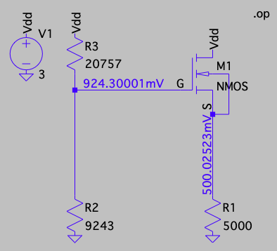
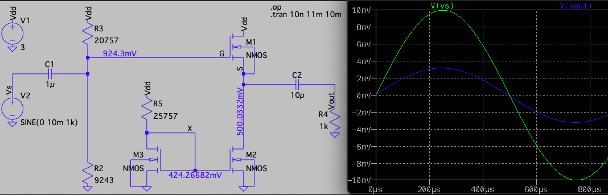
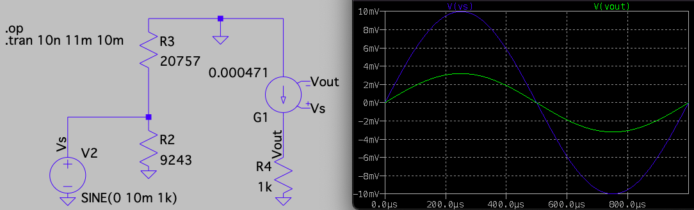

```{r setup, include = FALSE}
knitr::opts_chunk$set(echo = FALSE, message = FALSE, warning = FALSE, fig.height = 3.25, fig.width = 6.5, fig.align = 'center')
library(ggplot2)
library(latex2exp)
```

<!--
See Figure \ref{fig:p3mod} below.

{#fig:p3mod width=600 height=300}
-->

# Introduction

This lab is an interesting introduction to MOSFET amplifiers.
We compose an emitter follower amplifier with a MOSFET pair current source
as a load. I did not have enough time to prototype the
circuit and measure the DC and AC characteristics.

# Design Procedure

Here are the calculated values for the biasing and
with $R_E = 5000 \Omega$:

{width=50% align='center'}

Here are the calculated values for the biasing and current source topologies:



Note that these LTspice nmos4 madels all have $W = 10$ and $L=0.18$,
and simulations showed that $\beta_n = 1.111\, mA/V^2$,
because $\mu_n C_{ox}= 20\, \mu A/V^2$ (found with $W = L$).

# Small Signal Model

Here is the AC circuit model that has the same output response
as the full DC model:



# Voltage gain

The voltage gain is

$$\frac {v_{out}}{v_in} = \frac {g_m R_L}{1 + g_m R_L} = 
\frac {(0.000471)(1000)}{1 + (0.000471)(1000)} = \frac {0.471}{1.471} = 0.320$$

The LTspice simulation has the $v_{out}$ amplitude as 0.3197.


